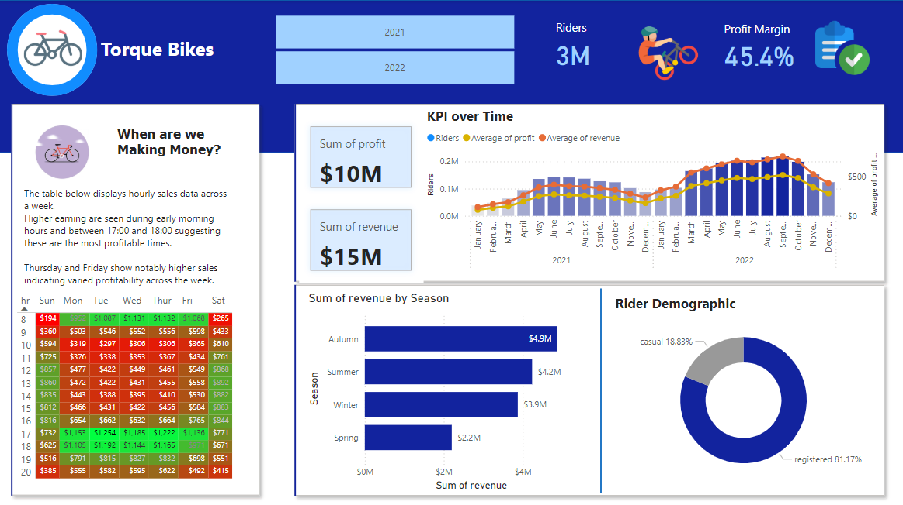

# Data Portfolio Bike Sales Analysis (Excel - SQL - PowerBI)

# Table of Contents

- [Objective](#Objective)
  - [User Story](#User_Story)
- [Data Source](#Data_Source)
- [Stages](#Stages)
- [Design](#Design)
  - [Dashboard Mockup](#Dashboard_Mockup)
  - [Tools](#Tools)
- [Development](#Development)
  - [Pseudocode](#Pseudocode)
  - [Data Exploration](#Data_Exploration)
  - [Data Cleaning](#Data_Cleaning)
  - [Transform the data](#Transform_the_data)
- [Testing](#Testing)
  - [Data Quality Tests](#Data_Quality_Tests)
- [Visualisation](#Visualisation)
  - [Results](#Results)
  - [DAX Measures](#DAX_Measures)
- [Analysis](#Analysis)
  - [Findings](#Findings)
  - [Validation](#Validation)
- [Conclusion](#Conclusion)
  - [Discovery](#Discovery)
  - [Recommendations](#Recommendations)
  - [Potential ROI](#Potential_ROI)
  - [Course of Action](#Course_of_Action)


# Objective
- Key issue:

The sales team wants to assess the performance of the bike scheme to set up campaigns to increase sales.

- Proposed Solution:
  
A dashboard will be created to provide actionable insights into the bike hire scheme. The dashboard will include:
- Weekly performance of the scheme
- Total rider count
- Total profit
- Annual performance with revenue and profit margins
- Rider loyalty details
  
These metrics will assist the sales team decide on which seasons/ times would be best for the proposed promotional campaigns.

## User Story
" As the lead of the sales team, I need to visualise key metrics through an informative dashboard to analyse bike hire data.

This should allow our team to identify the top performing periods through sales metrics. The insights gathered will drive decisions about when is best to apply our new sales campaigns and maximise potential ROI"

# Data Source

- We need sales data for the bike hire scheme in 2021 and 2022 that includes:
 - Weekly performance of the scheme
- Total rider count
- Total profit
- Annual performance with revenue and profit margins
- Rider loyalty details

  - Where the data is coming from? (The data is sourced from csv files from sales records found [here](BikeSalesAnalysis/assets/rawdata))
  
# Stages

1. Design
2. Development
3. Testing
4. Analysis
   
# Design

## Dashboard Questions
- What should the dashboard contain based on the above requirements?
  
- What are the initial insight questions the dashboard needs to answer?
1. What are the most profitable times of the week for the scheme?
2. Is our rider count growing?
3. Is Profity increasing from 2021 to 2022?
4. What seasons are most profitable?
5. What proportion of our riders are signed up to the scheme?

As we progress through the analysis, these questions may develop.

## Dashboard Mockup

Recommended data visuals:
1. Table
2. Donut Chart
3. Scorecards
4. Horizontal bar chart
5. Vertical Bar chart (time history)


## Tools

| Tool  | Purpose                                                   |
| --------- | ----------------------------------------------------- |
| Excel     | Exploring the data                                    |
| SQL       | Cleaning, testing and analysing the data              |
| Power BI  | Visualizing the data and gathering insights           |
| GitHub    | Hosting the project documentation and version control |
| Mokkup AI | Designing the wireframe of the dashboard              |


# Development
## Pseudocode

- What is the general approach to solving the issue from end to end?

1. Gather the data
2. Explore the data in Excel
3. Load the data into SQL
4. Clean the data in SQL
5. Visualise the data in Power BI
6. Generate the findings based on the insights
7. Write-up documentation and commentary
8. Publish the data to relevant stakeholders


## Data Exploration

The gathered data will be audited for quality looking mainly for errors, inconsistencies, bugs and unusual characters and/or layout of data etc.

- What are the findings from the data exploration?

1. All relevant data is present within the files gathered so no need to request more data.
2. Date fields, especially weekdays need to be edited from 0 to 6 and changed to 1 to 7.
3. Some data types need to be changed from numbers to text.
4. Data will need to be joined to give overall performance across both years and to find profit and revenue.

## Data Cleaning

- What do we expect the clean data to contain and what constraints are required?

1. Relevant columns should be retained.
2. All data types should be appropriate for the contents of each column.
3. There should be no null values i.e. complete data for all records.


### Transform the Data

```sql

SELECT *
FROM bike_share_yr_0

SELECT *
FROM cost_table
  -- Explore data
  -- Change seasons, months, weekdays from numbers to text. weekday to be changed from 1-7 instead of 0-6
  --Use Union to only pull through no duplicates to connect both years then use a join to pull through the prices of the cost table.

WITH bike_share_all AS
(
  SELECT *
FROM bike_share_yr_0
UNION
  SELECT *
FROM bike_share_yr_1)


--Use left join to get cost table records based on bike_share_all

SELECT dteday,season,bike_share_all.yr,mnth,hr,weekday,rider_type,riders,price,COGS, riders*price as revenue, riders*price- COGS*riders as profit
FROM bike_share_all
LEFT JOIN cost_table 
ON bike_share_all.yr = cost_table.yr

--Connect PowerBI to SQL database and start building dashboard

```


# Testing
## Data quality tests

- As the data set is small, we can carry out this check on initial EDA

# Visualization

## Results

How does the dashboards look?




## DAX Measures

### 1. Profit Margin

```sql
Profit Margin = 
(SUM(Query1[revenue])-SUM(Query1[profit])/SUM(Query1[profit]))

RETURN ProfitMargin

```


# Analysis
## Findings

In this section we will answer our design stage questions:
1. What are the most profitable times of the week for the scheme?
2. Is our rider count growing?
3. Is Profity increasing from 2021 to 2022?
4. What seasons are most profitable?
5. What proportion of our riders are signed up to the scheme?

### 1. What are the most profitable times of the week for the scheme?

| Rank | Channel Name         | Subscribers (M) |
|------|----------------------|-----------------|
| 1    | NoCopyrightSounds    | 33.60           |
| 2    | DanTDM               | 28.60           |
| 3    | Dan Rhodes           | 26.50           |
| 4    | Miss Katy            | 24.50           |
| 5    | Mister Max           | 24.40           |
| 6    | KSI                  | 24.10           |
| 7    | Jelly                | 23.50           |
| 8    | Dua Lipa             | 23.30           |
| 9    | Sidemen              | 21.00           |
| 10   | Ali-A                | 18.90           |


### 2. Is our rider count growing?

| Rank | Channel Name    | Videos Uploaded |
|------|-----------------|-----------------|
| 1    | GRM Daily       | 14,696          |
| 2    | Manchester City | 8,248           |
| 3    | Yogscast        | 6,435           |


### 3. Is Profity increasing from 2021 to 2022?

| Rank | Channel Name | Total Views (B) |
|------|--------------|-----------------|
| 1    | DanTDM       | 19.78           |
| 2    | Dan Rhodes   | 18.56           |
| 3    | Mister Max   | 15.97           |


### 4. What seasons are most profitable?

| Channel Name | Averge Views per Video (M) |
|--------------|-----------------|
| Mark Ronson  | 32.27           |
| Jessie J     | 5.97            |
| Dua Lipa     | 5.76            |

### 5. What proportion of our riders are signed up to the scheme?

| Rank | Channel Name       | Views per Subscriber        |
|------|-----------------   |---------------------------- |
| 1    | GRM Daily          | 1185.79                     |
| 2    | Nickelodeon        | 1061.04                     |
| 3    | Disney Junior UK   | 1031.97                     |


# Conclusion
## Discovery

What were the overall findings?


1. NoCopyrightSOunds, Dan Rhodes and DanTDM are the channnels with the most subscribers in the UK
2. GRM Daily, Man City and Yogscast are the channels with the most videos uploaded
3. DanTDM, Dan RHodes and Mister Max are the channels with the most views
4. Entertainment channels are useful for broader reach, as the channels posting consistently on their platforms and generating the most engagement are focus on entertainment and music 

## Recommendations

Actionable Insights:


1. **Dan Rhodes** is the best YouTube channel to collaborate with if we want to **maximize visbility** because this channel has the **most YouTube subscribers in the UK**.
   
2. Although GRM Daily, Man City and Yogcasts are regular publishers on YouTube, it may be worth considering whether collaborating with them with the current budget caps are worth the effort, as the potential return on investments is significantly lower compared to the other channels.
   
3. **Mister Max** is the best YouTuber to collaborate with if we're interested in **maximizing reach**, but collaborating with **DanTDM and Dan Rhodes** may be better **long-term options** considering the fact that they both have large subscriber bases and are averaging significantly high number of views.
   
4. The top 3 channels to form collaborations with are NoCopyrightSounds, DanTDM and Dan Rhodes based on this analysis, because they attract the most engagement on their channels consistently.


## Potential ROI
What ROI is expected based on the actionable insights?

1. Setting up a **product placement** deal with **Dan Rhodes** would make the client a net profit of **£1,065,000 per video**.
2. An **influencer marketing contract** with **Mister Max** can see the client generate a net profit of **£1,276,000**.
3. If we go with a **product placement campaign** with **DanTDM**, this could  generate the client approximately **£484,000 per video**. If we advance with an **influencer marketing campaign** deal instead, this would make the client a one-off net profit of **£404,000**.
4. **NoCopyrightSounds product placement** could profit the client **£642,000 per video** too (which is worth considering). 


## Course of Action

Based on the analysis, the best channel to partner with on a **product placement** deal would be **Dan Rhodes**.
This initial deal will be assessed againsts the marketing teams initial forecasting. If the milestones are met throughout the deal, then future partnerships with DanTDM, Mister Max and NoCopyrightSounds can be advanced.

Actioning the Insights:

1. Reach out to the teams behind each of these channels, starting with Dan Rhodes.
2. Negotiate contracts within the budgets allocated to each marketing campaign.
3. Kick off the campaigns and track each of their performances against the KPIs.
4. Review how the campaigns have gone, gather insights and optimize based on feedback from converted customers and each channel's audiences.


