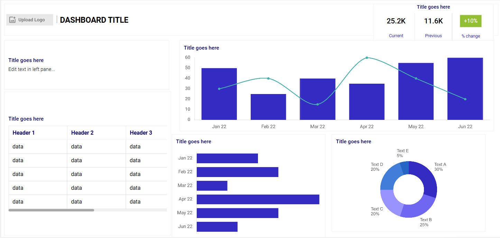
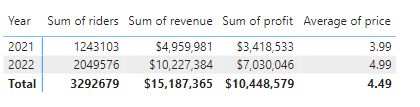

# Data Portfolio Bike Sales Analysis (Excel - SQL - PowerBI)

# Table of Contents

- [Objective](#Objective)
  - [User Story](#User_Story)
- [Data Source](#Data_Source)
- [Stages](#Stages)
- [Design](#Design)
  - [Dashboard Mockup](#Dashboard_Mockup)
  - [Tools](#Tools)
- [Development](#Development)
  - [Pseudocode](#Pseudocode)
  - [Data Exploration](#Data_Exploration)
  - [Data Cleaning](#Data_Cleaning)
  - [Transform the data](#Transform_the_data)
- [Testing](#Testing)
  - [Data Quality Tests](#Data_Quality_Tests)
- [Visualisation](#Visualisation)
  - [Results](#Results)
  - [DAX Measures](#DAX_Measures)
- [Analysis](#Analysis)
  - [Findings](#Findings)
  - [Validation](#Validation)
- [Conclusion](#Conclusion)
  - [Discovery](#Discovery)
  - [Recommendations](#Recommendations)
  - [Potential ROI](#Potential_ROI)


# Objective
- Key issue:

The sales team wants to assess the performance of the bike scheme to set up campaigns to increase sales.

- Proposed Solution:
  
A dashboard will be created to provide actionable insights into the bike hire scheme. The dashboard will include:
- Weekly performance of the scheme
- Total rider count
- Total profit
- Annual performance with revenue and profit margins
- Rider loyalty details
  
These metrics will assist the sales team decide on which seasons/ times would be best for the proposed promotional campaigns.

## User Story
" As the lead of the sales team, I need to visualise key metrics through an informative dashboard to analyse bike hire data.

This should allow our team to identify the top performing periods through sales metrics. The insights gathered will drive decisions about when is best to apply our new sales campaigns and maximise potential ROI"

# Data Source

- We need sales data for the bike hire scheme in 2021 and 2022 that includes:
 - Weekly performance of the scheme
- Total rider count
- Total profit
- Annual performance with revenue and profit margins
- Rider loyalty details

  - Where the data is coming from? (The data is sourced from csv files from sales records found [here](BikeSalesAnalysis/assets/rawdata))
  
# Stages

1. Design
2. Development
3. Testing
4. Analysis
   
# Design

## Dashboard Questions
- What should the dashboard contain based on the above requirements?
  
- What are the initial insight questions the dashboard needs to answer?
1. What are the most profitable times of the week for the scheme?
2. Is our rider count growing?
3. Is Profit increasing from 2021 to 2022?
4. What seasons are most profitable?
5. What proportion of our riders are signed up to the scheme?

As we progress through the analysis, these questions may develop.

## Dashboard Mockup

Recommended data visuals:
1. Table
2. Donut Chart
3. Scorecards
4. Horizontal bar chart
5. Vertical Bar chart (time history)



## Tools

| Tool  | Purpose                                                   |
| --------- | ----------------------------------------------------- |
| Excel     | Exploring the data                                    |
| SQL       | Cleaning, testing and analysing the data              |
| Power BI  | Visualizing the data and gathering insights           |
| GitHub    | Hosting the project documentation and version control |
| Mokkup AI | Designing the wireframe of the dashboard              |


# Development
## Pseudocode

- What is the general approach to solving the issue from end to end?

1. Gather the data
2. Explore the data in Excel
3. Load the data into SQL
4. Clean the data in SQL
5. Visualise the data in Power BI
6. Generate the findings based on the insights
7. Write-up documentation and commentary
8. Publish the data to relevant stakeholders


## Data Exploration

The gathered data will be audited for quality looking mainly for errors, inconsistencies, bugs and unusual characters and/or layout of data etc.

- What are the findings from the data exploration?

1. All relevant data is present within the files gathered so no need to request more data.
2. Date fields, especially weekdays need to be edited from 0 to 6 and changed to 1 to 7.
3. Some data types need to be changed from numbers to text.
4. Data will need to be joined to give overall performance across both years and to find profit and revenue.

## Data Cleaning

- What do we expect the clean data to contain and what constraints are required?

1. Relevant columns should be retained.
2. All data types should be appropriate for the contents of each column.
3. There should be no null values i.e. complete data for all records.


### Transform the Data

```sql

SELECT *
FROM bike_share_yr_0

SELECT *
FROM cost_table
  -- Explore data
  -- Change seasons, months, weekdays from numbers to text. weekday to be changed from 1-7 instead of 0-6
  --Use Union to only pull through no duplicates to connect both years then use a join to pull through the prices of the cost table.

WITH bike_share_all AS
(
  SELECT *
FROM bike_share_yr_0
UNION
  SELECT *
FROM bike_share_yr_1)


--Use left join to get cost table records based on bike_share_all

SELECT dteday,season,bike_share_all.yr,mnth,hr,weekday,rider_type,riders,price,COGS, riders*price as revenue, riders*price- COGS*riders as profit
FROM bike_share_all
LEFT JOIN cost_table 
ON bike_share_all.yr = cost_table.yr

--Connect PowerBI to SQL database and start building dashboard

```


# Testing
## Data quality tests

- As the data set is small, we can carry out this check on initial EDA

# Visualization

## Results

How does the dashboards look?


## DAX Measures

### 1. Profit Margin

```sql
Profit Margin = 
(SUM(Query1[revenue])-SUM(Query1[profit])/SUM(Query1[profit]))

RETURN ProfitMargin

```


# Analysis
## Findings

In this section we will answer our design stage questions:
1. What are the most profitable times of the week for the scheme?
2. Is our rider count growing?
3. Is Profit increasing from 2021 to 2022?
4. What seasons are most profitable?
5. What proportion of our riders are signed up to the scheme?

### 1. What are the most profitable times of the week for the scheme?

| Rank | Time of week              | Average Sales ($)|
|------|---------------------------|------------------|
| 1    | Weekday 17:00 to 18:00    | 1,132            |
| 2    | Weekday 08:00             | 1,054            |
| 3    | Weekend 12:00 to 17:00    | 1,005            |


### 2. Is our rider count growing?

| Rank | Year | Rider Count (Millions) |
|------|------|------------------------|
| 1    | 2021 | 1.24                   |
| 2    | 2022 | 2.05                   |


### 3. Is Profit increasing from 2021 to 2022?

| Rank | Year | Profit($) |
|------|------|-----------|
| 1    | 2021 | 3.42M     |
| 2    | 2022 | 7.03M     |


### 4. What seasons are most profitable?

| Rank | Season      | Sales ($) |
|------|-------------|-----------|
| 1    | Autumn      | 4.9M      |
| 2    | Summer      | 4.2M      |
| 3    | Winter      | 3.9M      |
| 4    | Spring      | 2.2M      |

### 5. What proportion of our riders are signed up to the scheme?

| Demographic   | Proportion (%) |
|---------------|----------------|
| Registered    | 81.17          |
| Casual        | 18.83          |


# Conclusion
## Discovery

What were the overall findings?

1. The most profitable times of the week year on year were during rush hour (17:00 to 18:00), accounting for an average of $1,132 during this time.
2. Rider Count doubed from 2021 to 2022
3. Profit from 2021 to 2022 doubled from $3.42M to $7.03M
4. Autumn is the most profitable season
5. The vast majority of riders are registered with the scheme

## Recommendations

Actionable Insights:



1. From 2021 to 2022, there were **more riders** and thus a higher revenue and profit showing that the scheme is growing. **Revenue doubled from $5M to $10M in a year.**
   
2. Between the two years, the **most profitable** times were during **rush hour in the morning and evening** during the week and during the **afternoon at the weekends**. **Loyalty promotions** should be applied during these times to maintain and increase custom. **Early Bird Discounts** could be applied during weekend mornings to maximise profit during these quiet times.
   
3. Autum and summer are the most profitable times of year with spring being the least profitable time. **Easter promotions** should be applied to increase sales during this season.
   
4. The majority of customers are registered with the scheme however **joining deals could be implemented** to further increase the number of registered users and thus increasing useful data.


## Potential ROI
What ROI is expected based on the actionable insights?

1.**Increasing the price of the hire by $1 (25%)** would see a large jump in revenue. This should be a focus as the **rider increase from 2021 to 2022 was 806,473 (64.8%)**, showing a clear increase in demand.

2. There is a **price elasticity of 2.56** so the price of the hire could be **increased by 10-15% ($5.49 - $5.74)**.

3. **In-depth market research** of riders, focusing on satisfaction, demographics of riders and even income could help push promotions and give more valuable insights that can be used for promotional campaigns.

4. A **segment price strategy** could be implemented based on **casual vs registered riders**.

5. **A price increase should be considered** and monitored through customer feedback. Based on immediate customer feedback and sales data, these price changes may have to be altered.


